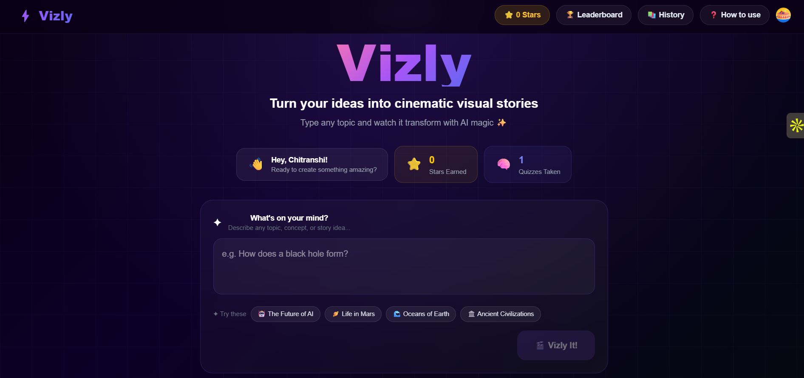
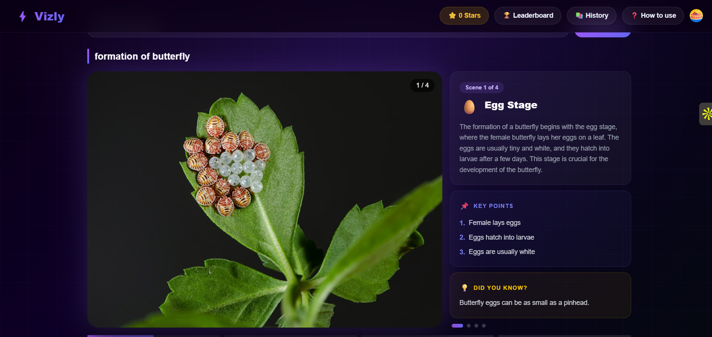
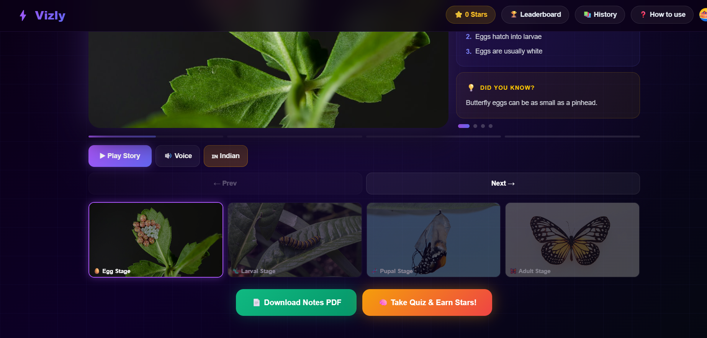
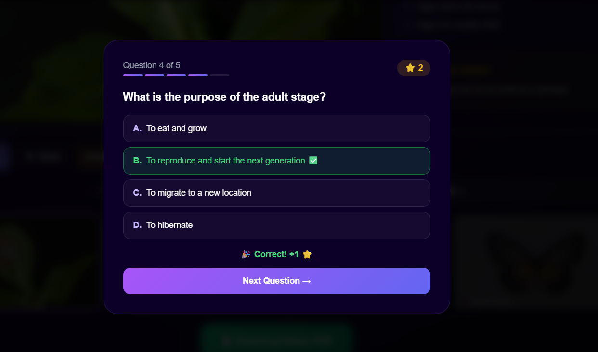
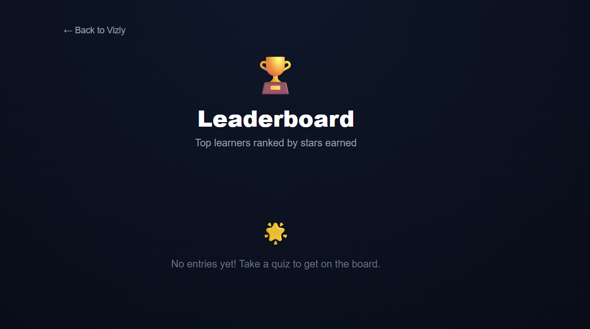

# ⚡ Vizly — Learn Anything Visually

> Turn any topic into a cinematic visual story with AI magic ✨

🌐 **Live Demo:** [vizly-one.vercel.app](https://vizly-one.vercel.app)

---

## 🎬 What is Vizly?

Vizly is an AI-powered visual learning app that transforms any topic into beautiful cinematic scenes with voice narration, detailed notes, and interactive quizzes.

Just type any topic → Watch it come to life!

---

## ✨ Features

| Feature | Description |
|---------|-------------|
| 🎬 **AI Scene Generation** | Converts any topic into 4 cinematic scenes |
| 🖼️ **HD Images** | Beautiful Unsplash photos for each scene |
| 🔊 **Voice Narration** | Indian & British English voice options |
| 📝 **Smart Notes** | Key points + Did You Know facts |
| 🧠 **Interactive Quiz** | 5 MCQ questions per topic |
| ⭐ **Star System** | Earn stars for correct answers |
| 🏆 **Leaderboard** | Global rankings powered by Supabase |
| 📚 **History** | All your past topics saved |
| 📄 **PDF Export** | Download detailed notes as PDF |
| 📱 **Mobile Ready** | Fully responsive design |

---

## 🛠️ Tech Stack

| Layer | Technology |
|-------|-----------|
| **Frontend** | Next.js 16, React, Tailwind CSS |
| **Animations** | Framer Motion |
| **AI Scenes** | Groq (Llama 3.3 70B) |
| **Images** | Unsplash API |
| **Auth** | Clerk |
| **Database** | Supabase (PostgreSQL) |
| **Deployment** | Vercel |

---

## 📸 Screenshots

### Home Page

### Scene Player

### Scene Process

### Quiz

### Leaderboard

---

## 🌟 How It Works

User types topic
↓
Groq AI generates 4 scenes + 5 quiz questions
↓
Unsplash fetches HD images for each scene
↓
Cinematic player with Ken Burns effect
↓
Voice narration synced with slides
↓
Quiz with star rewards
↓
Results saved to Supabase leaderboard
